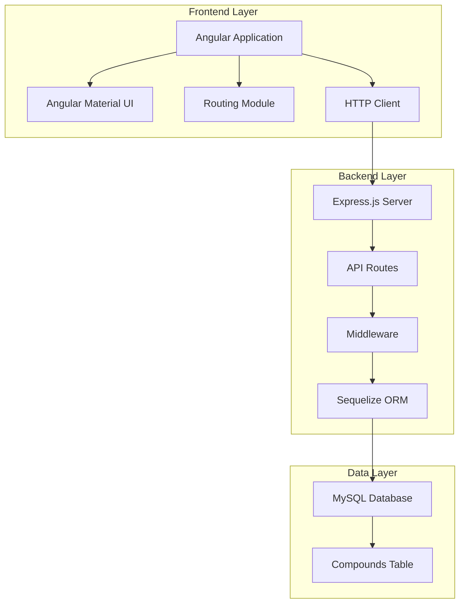

# Design Document

## Overview

The Chemical Compound Manager is a full-stack web application built with Angular frontend, Express.js backend, and MySQL database. The system follows a three-tier architecture with clear separation of concerns, RESTful API design, and responsive UI components.

## Architecture

### System Architecture



### Technology Stack

**Frontend:**
- Angular 15+ with TypeScript
- Angular Material for UI components
- Angular Router for navigation
- RxJS for reactive programming
- Custom CSS/SCSS for styling

**Backend:**
- Node.js with Express.js framework
- Sequelize ORM for database operations
- Express middleware for validation and error handling
- CORS support for cross-origin requests

**Database:**
- MySQL for data persistence
- Single compounds table with structured schema

## Components and Interfaces

### Frontend Components

#### 1. App Component
- Root component managing global layout
- Navigation header with application title
- Router outlet for page components

#### 2. Compound Gallery Component
- Grid layout displaying compound cards
- Pagination controls
- Search and filter capabilities (future enhancement)

#### 3. Compound Card Component
- Reusable card displaying compound preview
- Click handler for navigation to details
- Hover effects and animations

#### 4. Compound Details Component
- Full compound information display
- High-resolution image rendering
- Navigation to edit page
- Breadcrumb navigation

#### 5. Compound Edit Component
- Form-based editing interface
- Input validation and error display
- Save/cancel functionality
- Image URL preview

#### 6. Pagination Component
- Reusable pagination controls
- Page size configuration
- Navigation state management

### Backend API Endpoints

#### Compound Routes

```typescript
// GET /api/compounds?page=1&limit=10
interface PaginatedCompoundsResponse {
  compounds: Compound[];
  totalCount: number;
  currentPage: number;
  totalPages: number;
}

// GET /api/compounds/:id
interface CompoundResponse {
  compound: Compound;
}

// PUT /api/compounds/:id
interface UpdateCompoundRequest {
  name?: string;
  image?: string;
  description?: string;
}
```

### Service Layer

#### Frontend Services

1. **CompoundService**
   - HTTP client wrapper for API calls
   - Caching mechanism for compound data
   - Error handling and retry logic

2. **PaginationService**
   - State management for pagination
   - URL parameter synchronization
   - Page navigation utilities

#### Backend Services

1. **CompoundController**
   - Request handling and response formatting
   - Input validation
   - Error response generation

2. **CompoundRepository**
   - Database abstraction layer
   - CRUD operations using Sequelize
   - Query optimization

## Data Models

### Database Schema

```sql
CREATE TABLE compounds (
  id INT PRIMARY KEY AUTO_INCREMENT,
  name VARCHAR(255) NOT NULL,
  image VARCHAR(500) NOT NULL,
  description TEXT,
  created_at TIMESTAMP DEFAULT CURRENT_TIMESTAMP,
  updated_at TIMESTAMP DEFAULT CURRENT_TIMESTAMP ON UPDATE CURRENT_TIMESTAMP
);
```

### TypeScript Interfaces

```typescript
interface Compound {
  id: number;
  name: string;
  image: string;
  description: string;
  createdAt?: Date;
  updatedAt?: Date;
}

interface PaginationParams {
  page: number;
  limit: number;
}

interface PaginatedResult<T> {
  data: T[];
  totalCount: number;
  currentPage: number;
  totalPages: number;
}
```

### Sequelize Model

```typescript
class CompoundModel extends Model {
  public id!: number;
  public name!: string;
  public image!: string;
  public description!: string;
  public readonly createdAt!: Date;
  public readonly updatedAt!: Date;
}
```

## Error Handling

### Frontend Error Handling

1. **HTTP Error Interceptor**
   - Global error handling for API calls
   - User-friendly error message display
   - Automatic retry for transient failures

2. **Form Validation**
   - Real-time input validation
   - Custom validators for URLs and text length
   - Error message display with Angular Material

3. **Loading States**
   - Skeleton loaders for compound cards
   - Progress indicators for form submissions
   - Fallback UI for failed image loads

### Backend Error Handling

1. **Global Error Middleware**
   - Centralized error processing
   - Structured error responses
   - Logging for debugging

2. **Validation Middleware**
   - Input sanitization and validation
   - Schema-based validation using Joi or similar
   - Custom validation rules for compound data

3. **Database Error Handling**
   - Connection error recovery
   - Transaction rollback on failures
   - Graceful degradation for read operations

## Testing Strategy

### Frontend Testing

1. **Unit Tests**
   - Component testing with Angular Testing Utilities
   - Service testing with mocked dependencies
   - Pipe and utility function testing

2. **Integration Tests**
   - Component interaction testing
   - HTTP service testing with mock backend
   - Routing and navigation testing

3. **E2E Tests**
   - User workflow testing with Protractor/Cypress
   - Cross-browser compatibility testing
   - Responsive design validation

### Backend Testing

1. **Unit Tests**
   - Controller function testing
   - Service layer testing with mocked database
   - Utility function testing

2. **Integration Tests**
   - API endpoint testing with test database
   - Database operation testing
   - Middleware testing

3. **API Tests**
   - Request/response validation
   - Error scenario testing
   - Performance testing for pagination

## Security Considerations

### Input Validation
- Server-side validation for all API inputs
- SQL injection prevention through Sequelize
- XSS prevention through input sanitization

### Data Protection
- Environment-based configuration
- Secure database connection strings
- Input length limits and type validation

### Future Security Enhancements
- JWT-based authentication system
- Role-based access control
- API rate limiting
- HTTPS enforcement

## Performance Optimization

### Frontend Optimization
- Lazy loading for route modules
- Image optimization and caching
- Virtual scrolling for large datasets
- OnPush change detection strategy

### Backend Optimization
- Database query optimization
- Response caching for read operations
- Connection pooling for database
- Compression middleware for responses

### Database Optimization
- Proper indexing on frequently queried fields
- Query result caching
- Connection pooling configuration
- Regular maintenance and optimization

## Deployment Architecture

### Development Environment
- Local MySQL instance
- Angular dev server with proxy configuration
- Express server with nodemon for hot reload
- Environment-specific configuration files

### Production Considerations
- Docker containerization for consistent deployment
- Environment variable management
- Database migration scripts
- Static asset optimization and CDN integration

## Future Enhancements

### Phase 2 Features
- Advanced search and filtering
- Compound comparison functionality
- Export capabilities (PDF, CSV)
- User favorites and bookmarking

### Phase 3 Features
- Multi-user support with authentication
- Compound categorization and tagging
- Advanced analytics and reporting
- Mobile application development