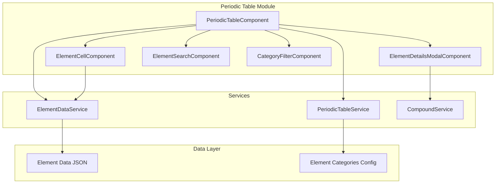

# Design Document

## Overview

The Periodic Table Viewer is an interactive Angular component that provides a comprehensive view of the periodic table of elements. It integrates seamlessly with the existing Chemical Compound Manager application, offering users an intuitive way to explore chemical elements and their properties through a responsive, accessible interface.

## Architecture

### Component Architecture



### Integration with Existing System

The Periodic Table Viewer integrates with the Chemical Compound Manager through:
- Shared navigation service for routing
- Compound service for element-compound relationships
- Consistent Material Design components
- Unified styling and theming

## Components and Interfaces

### 1. PeriodicTableComponent

**Purpose:** Main container component managing the periodic table layout and interactions

**Key Features:**
- Renders the complete 18x7 periodic table grid
- Manages element selection and highlighting states
- Coordinates search and filter functionality
- Handles responsive layout adjustments

**Template Structure:**
```html
<div class="periodic-table-container">
  <app-element-search (searchChange)="onSearchChange($event)"></app-element-search>
  <app-category-filter (categoryChange)="onCategoryChange($event)"></app-category-filter>
  
  <div class="periodic-table-grid">
    <app-element-cell 
      *ngFor="let element of elements" 
      [element]="element"
      [highlighted]="isHighlighted(element)"
      [dimmed]="isDimmed(element)"
      (elementClick)="onElementClick($event)">
    </app-element-cell>
  </div>
  
  <div class="category-legend">
    <!-- Category color legend -->
  </div>
</div>
```

### 2. ElementCellComponent

**Purpose:** Individual element cell displaying basic element information

**Key Features:**
- Displays atomic number, symbol, and name
- Category-based color coding
- Hover and focus states
- Keyboard navigation support

**Input Properties:**
```typescript
interface ElementCellInput {
  element: Element;
  highlighted: boolean;
  dimmed: boolean;
}
```

**Template Structure:**
```html
<div class="element-cell" 
     [class.highlighted]="highlighted"
     [class.dimmed]="dimmed"
     [style.background-color]="element.categoryColor"
     (click)="onElementClick()"
     tabindex="0"
     [attr.aria-label]="getAriaLabel()">
  <div class="atomic-number">{{ element.atomicNumber }}</div>
  <div class="symbol">{{ element.symbol }}</div>
  <div class="name">{{ element.name }}</div>
</div>
```

### 3. ElementDetailsModalComponent

**Purpose:** Modal dialog displaying comprehensive element information

**Key Features:**
- Detailed element properties display
- Integration with compound search
- Keyboard navigation and accessibility
- Responsive design for mobile devices

**Data Interface:**
```typescript
interface ElementDetails {
  basicInfo: {
    atomicNumber: number;
    symbol: string;
    name: string;
    atomicMass: number;
  };
  properties: {
    category: ElementCategory;
    group: number;
    period: number;
    electronConfiguration: string;
    meltingPoint?: number;
    boilingPoint?: number;
    density?: number;
  };
  description: string;
}
```

### 4. ElementSearchComponent

**Purpose:** Search functionality for finding specific elements

**Key Features:**
- Real-time search with debouncing
- Multi-criteria search (name, symbol, atomic number)
- Search result highlighting
- Clear search functionality

**Search Logic:**
```typescript
searchElements(query: string): Element[] {
  const normalizedQuery = query.toLowerCase().trim();
  return this.elements.filter(element => 
    element.name.toLowerCase().includes(normalizedQuery) ||
    element.symbol.toLowerCase().includes(normalizedQuery) ||
    element.atomicNumber.toString().includes(normalizedQuery)
  );
}
```

### 5. CategoryFilterComponent

**Purpose:** Filter controls for element categories

**Key Features:**
- Toggle buttons for each element category
- Visual indication of active filters
- Category color coding
- Clear all filters option

## Data Models

### Element Data Structure

```typescript
interface Element {
  atomicNumber: number;
  symbol: string;
  name: string;
  atomicMass: number;
  category: ElementCategory;
  group: number;
  period: number;
  electronConfiguration: string;
  meltingPoint?: number;
  boilingPoint?: number;
  density?: number;
  description: string;
  gridPosition: {
    row: number;
    column: number;
  };
}

enum ElementCategory {
  ALKALI_METALS = 'alkali-metals',
  ALKALINE_EARTH_METALS = 'alkaline-earth-metals',
  TRANSITION_METALS = 'transition-metals',
  POST_TRANSITION_METALS = 'post-transition-metals',
  METALLOIDS = 'metalloids',
  NONMETALS = 'nonmetals',
  HALOGENS = 'halogens',
  NOBLE_GASES = 'noble-gases',
  LANTHANIDES = 'lanthanides',
  ACTINIDES = 'actinides'
}
```

### Category Configuration

```typescript
interface CategoryConfig {
  [key: string]: {
    name: string;
    color: string;
    description: string;
  };
}

const ELEMENT_CATEGORIES: CategoryConfig = {
  'alkali-metals': {
    name: 'Alkali Metals',
    color: '#ff6b6b',
    description: 'Highly reactive metals in group 1'
  },
  'alkaline-earth-metals': {
    name: 'Alkaline Earth Metals',
    color: '#ffa726',
    description: 'Reactive metals in group 2'
  },
  // ... other categories
};
```

## Services

### ElementDataService

**Purpose:** Manages element data loading and caching

**Key Methods:**
```typescript
class ElementDataService {
  getAllElements(): Element[] { }
  getElementById(id: number): Element | undefined { }
  getElementsByCategory(category: ElementCategory): Element[] { }
  searchElements(query: string): Element[] { }
  validateElementData(): boolean { }
}
```

### PeriodicTableService

**Purpose:** Manages periodic table state and interactions

**Key Methods:**
```typescript
class PeriodicTableService {
  private selectedElement$ = new BehaviorSubject<Element | null>(null);
  private searchQuery$ = new BehaviorSubject<string>('');
  private activeFilters$ = new BehaviorSubject<ElementCategory[]>([]);
  
  selectElement(element: Element): void { }
  setSearchQuery(query: string): void { }
  toggleCategoryFilter(category: ElementCategory): void { }
  clearFilters(): void { }
  
  getFilteredElements(): Observable<Element[]> { }
  getHighlightedElements(): Observable<Element[]> { }
}
```

## Styling and Layout

### CSS Grid Layout

```scss
.periodic-table-grid {
  display: grid;
  grid-template-columns: repeat(18, 1fr);
  grid-template-rows: repeat(7, 1fr);
  gap: 2px;
  max-width: 1200px;
  margin: 0 auto;
  
  @media (max-width: 768px) {
    overflow-x: auto;
    min-width: 800px;
  }
}

.element-cell {
  aspect-ratio: 1;
  display: flex;
  flex-direction: column;
  justify-content: center;
  align-items: center;
  border: 1px solid #ccc;
  border-radius: 4px;
  cursor: pointer;
  transition: all 0.2s ease;
  
  &:hover {
    transform: scale(1.05);
    box-shadow: 0 2px 8px rgba(0,0,0,0.2);
  }
  
  &.highlighted {
    box-shadow: 0 0 0 3px #2196f3;
  }
  
  &.dimmed {
    opacity: 0.3;
  }
}
```

### Category Colors

```scss
$category-colors: (
  'alkali-metals': #ff6b6b,
  'alkaline-earth-metals': #ffa726,
  'transition-metals': #42a5f5,
  'post-transition-metals': #66bb6a,
  'metalloids': #ab47bc,
  'nonmetals': #ffee58,
  'halogens': #26c6da,
  'noble-gases': #ef5350,
  'lanthanides': #ffa726,
  'actinides': #8d6e63
);
```

## Error Handling

### Data Validation

```typescript
validateElementData(elements: Element[]): ValidationResult {
  const errors: string[] = [];
  
  // Check for complete set of 118 elements
  if (elements.length !== 118) {
    errors.push(`Expected 118 elements, found ${elements.length}`);
  }
  
  // Validate atomic numbers are sequential
  const atomicNumbers = elements.map(e => e.atomicNumber).sort((a, b) => a - b);
  for (let i = 0; i < atomicNumbers.length; i++) {
    if (atomicNumbers[i] !== i + 1) {
      errors.push(`Missing or duplicate atomic number: ${i + 1}`);
    }
  }
  
  // Validate required fields
  elements.forEach(element => {
    if (!element.symbol || !element.name) {
      errors.push(`Element ${element.atomicNumber} missing required fields`);
    }
  });
  
  return { isValid: errors.length === 0, errors };
}
```

### Error States

- **Data Loading Errors:** Display fallback message with retry option
- **Search No Results:** Show "No elements found" message with search tips
- **Modal Loading Errors:** Graceful degradation with basic element info
- **Responsive Layout Issues:** Horizontal scroll with scroll indicators

## Testing Strategy

### Unit Tests

1. **Component Tests:**
   - Element cell rendering and interactions
   - Search functionality with various inputs
   - Filter state management
   - Modal opening and closing

2. **Service Tests:**
   - Element data loading and validation
   - Search algorithm accuracy
   - Filter logic correctness
   - State management consistency

### Integration Tests

1. **Component Integration:**
   - Search results updating element display
   - Filter interactions affecting visibility
   - Modal integration with element selection
   - Navigation between periodic table and compounds

2. **Data Integration:**
   - Element data loading and parsing
   - Category configuration application
   - Grid positioning accuracy

### E2E Tests

1. **User Workflows:**
   - Browse periodic table and select elements
   - Search for elements by different criteria
   - Filter by categories and view results
   - Navigate to related compounds
   - Use keyboard navigation throughout

## Accessibility Features

### Keyboard Navigation

```typescript
@HostListener('keydown', ['$event'])
onKeyDown(event: KeyboardEvent): void {
  const currentElement = this.selectedElement;
  if (!currentElement) return;
  
  switch (event.key) {
    case 'ArrowRight':
      this.selectAdjacentElement('right');
      break;
    case 'ArrowLeft':
      this.selectAdjacentElement('left');
      break;
    case 'ArrowUp':
      this.selectAdjacentElement('up');
      break;
    case 'ArrowDown':
      this.selectAdjacentElement('down');
      break;
    case 'Enter':
    case ' ':
      this.openElementDetails(currentElement);
      break;
  }
}
```

### Screen Reader Support

- ARIA labels for all interactive elements
- Role attributes for grid structure
- Live regions for search results and filter changes
- Descriptive text for element properties

### Visual Accessibility

- High contrast mode support
- Scalable text and UI elements
- Color-blind friendly category colors
- Focus indicators for keyboard navigation

## Performance Optimization

### Rendering Optimization

- OnPush change detection for element cells
- Virtual scrolling for mobile devices (if needed)
- Lazy loading of element details
- Memoized search and filter results

### Data Optimization

- Static element data bundled with application
- Efficient search algorithms with indexing
- Minimal DOM updates during interactions
- Optimized CSS animations and transitions

## Future Enhancements

### Phase 2 Features

- 3D periodic table visualization
- Element property trends visualization
- Interactive electron configuration diagrams
- Element discovery timeline

### Phase 3 Features

- Augmented reality periodic table
- Element quiz and learning modes
- Custom element collections and bookmarks
- Advanced property comparisons and charts